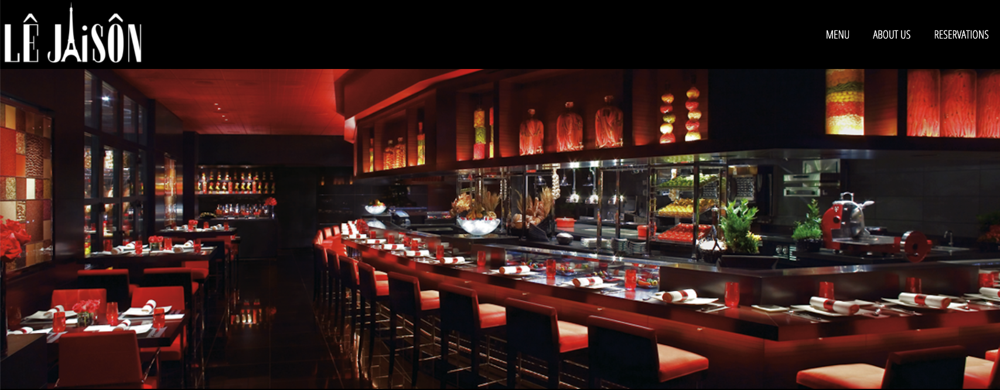

# LeJaison-Restaurant-Website

## Challenges I Faced?  

Working in a team is extremely beneficial to the project overall however, I need to careful how I communicate things to avoid miscommunication. Conceptually we know what we wanted to do and it sounded good in theory but implementation is an entirely different matter. I want to be able to incorporate Google maps and I have to do some research on it. 

## How Did I Over Come Those Challenges?

Coding together at the same time really did help, We didn't use the entire day to code together but just at the start of it so we had a general idea of the direction we each are headed in conceptually. Implementation became a lot easier after we completed our wire frame and after reading up on Google's API we were able to incorporate the Google maps widget. 

## What Did I Learn? 

* How to work in a team dynamic 
* How to properly understand and resolve development differences 
* Reinforce knowledge of CSS
* Expanded knowledge of JavaScript
* How to incorporate a Google map's widget into a site

